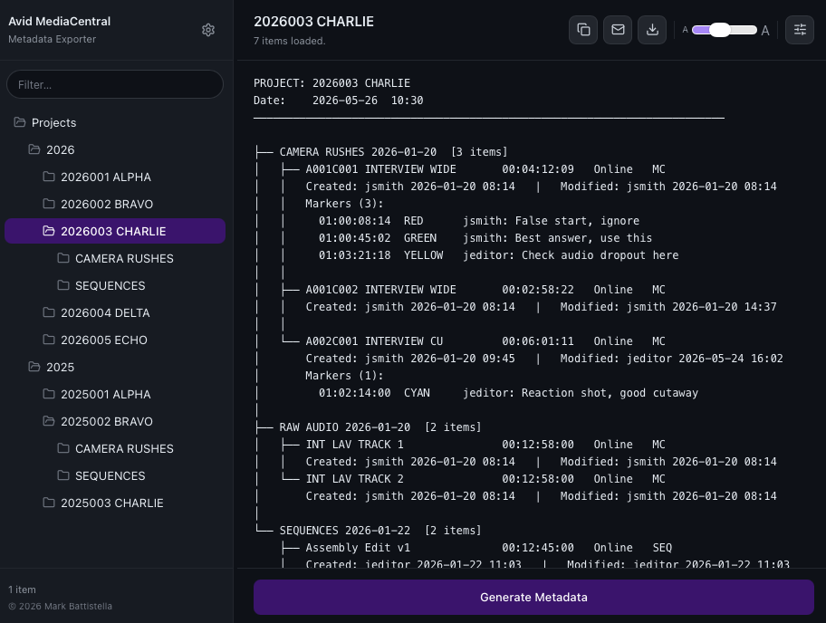
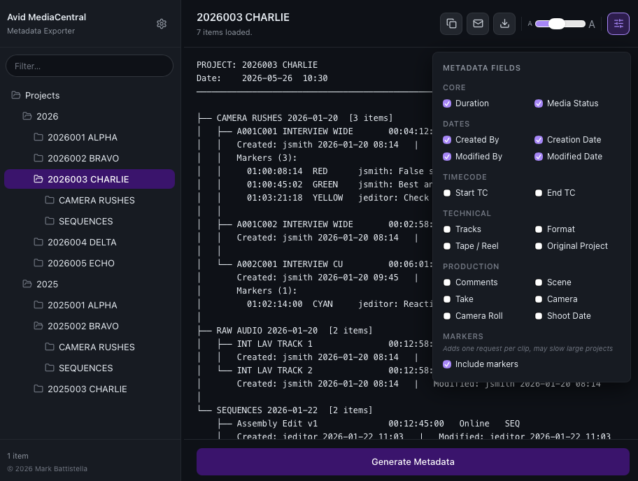

# MediaCentral Explorer



MediaCentral Explorer is a desktop app and command-line tool for browsing an
Avid MediaCentral workgroup and exporting readable asset metadata.

It is designed for people who need to quickly inspect projects, bins,
sequences, master clips, and related metadata without manually opening and
copying details from MediaCentral.

## What It Does

- Connects to an Avid MediaCentral Web Services endpoint
- Browses projects from an Interplay path
- Loads project contents, including bins, sequences, master clips, subclips, and folders
- Exports formatted metadata that can be pasted into an email or saved as text
- Lets you choose which metadata fields are included
- Copies results to the clipboard, saves them to a `.txt` file, or opens them in your email client
- Saves connection settings between sessions
- Stores credentials in Windows Credential Manager or macOS Keychain when available

## When To Use It

Use MediaCentral Explorer when you need to:

- Send a clean summary of project media to another person
- Check what clips, bins, or sequences exist inside a project
- Export metadata for production notes, handovers, troubleshooting, or audit trails
- Automate MediaCentral metadata lookups from scripts
- Quickly test whether a MediaCentral Web Services endpoint is reachable

## Download The App

The latest packaged app is available from the [GitHub Releases page](https://github.com/markbattistella/avid-interplay-metadata-exporter/releases/latest).

Download the installer for your platform:

- macOS: `MCExplorer.dmg`
- Windows: `MCExplorer-Setup.exe`

## Using The Desktop App

1. Open MediaCentral Explorer.
2. Enter your MediaCentral server address.
3. Enter your username and password.
4. Enter the Interplay path you want to browse, for example:

   ```text
   interplay://AvidWorkgroup/Projects/2026
   ```

5. Load the project list.
6. Select a project to load its bins, sequences, clips, and metadata.
7. Choose the fields you want included in the output.
8. Copy, save, or email the formatted result.

Server addresses are normalised automatically:

- `192.168.0.1` becomes `http://192.168.0.1:80`
- `https://192.168.0.1` becomes `https://192.168.0.1:443`
- `192.168.0.1:12345` becomes `http://192.168.0.1:12345`
- `https://192.168.0.1:12345` stays `https://192.168.0.1:12345`

## Using The CLI

You can also run the tool from the command line, which is useful for scripting
and automation.

Install Python dependencies first:

```bash
python3.13 -m pip install -r app/requirements.txt
```

On Windows, use:

```bat
pip install -r app\requirements.txt
```

### List Projects

```bash
python3.13 app/interplay_explorer.py \
  --server 192.168.1.10 \
  --user jsmith \
  --password secret \
  --path "interplay://AvidWorkgroup/Projects/2026"
```

Example output:

```text
Listing: interplay://AvidWorkgroup/Projects/2026
  2026001 ALPHA
  2026002 BRAVO
  2026003 CHARLIE

3 project(s) found.
```

### Export A Project

```bash
python3.13 app/interplay_explorer.py \
  --server 192.168.1.10 \
  --user jsmith \
  --password secret \
  --path "interplay://AvidWorkgroup/Projects/2026" \
  --project "BRAVO"
```

Example output:

```text
PROJECT: 2026002 BRAVO
Date:    25 May 2026  04:13 PM

RAW AUDIO RECORDINGS 22-01-2026
--------------------------------
  MC   Interview A                00:07:39:18   Online
    Created: jsmith 22/01/2026   |   Modified: jsmith 25/05/2026
  MC   Interview B                00:03:12:04   Online
    Created: jsmith 22/01/2026   |   Modified: jsmith 25/05/2026

SEQUENCES 22-01-2026
--------------------
  SEQ  Assembly Edit              00:12:45:00   Online
    Created: jsmith 22/01/2026   |   Modified: jeditor 24/05/2026
```

### Windows CLI Example

```bat
python app\interplay_explorer.py ^
  --server 192.168.1.10 ^
  --user jsmith ^
  --password secret ^
  --path "interplay://AvidWorkgroup/Projects/2026" ^
  --project "BRAVO"
```

## CLI Reference

| Flag | Required | Description |
| --- | --- | --- |
| `--server` | Yes | MediaCentral server address, IP address, or hostname |
| `--user` | Yes | MediaCentral username |
| `--password` | Yes | MediaCentral password |
| `--path` | Yes | Interplay URI to browse, such as `interplay://WorkgroupName/Projects/2026` |
| `--project` | No | Project name to load. Uses substring matching. Omit to list projects only. |
| `--fields` | No | Metadata fields to include, provided as quoted `Group.Name` pairs |

Example with selected fields:

```bash
python3.13 app/interplay_explorer.py \
  --server 192.168.1.10 \
  --user jsmith \
  --password secret \
  --path "interplay://AvidWorkgroup/Projects/2026" \
  --project "BRAVO" \
  --fields "System.Duration" "System.Media Status" "System.Creation Date"
```

## Output Fields

The default output includes duration, media status, and created/modified dates.
Additional fields can be enabled in the app or passed with `--fields` in the CLI.



Available field groups include:

| Group | Fields |
| --- | --- |
| Core | Duration, Media Status |
| Dates | Created By, Creation Date, Modified By, Modified Date |
| Timecode | Start Timecode, End Timecode |
| Technical | Tracks, Format, Tape / Reel, Original Project |
| Production | Comments, Scene, Take, Camera, Camera Roll, Shoot Date |
| Markers | Locators |
